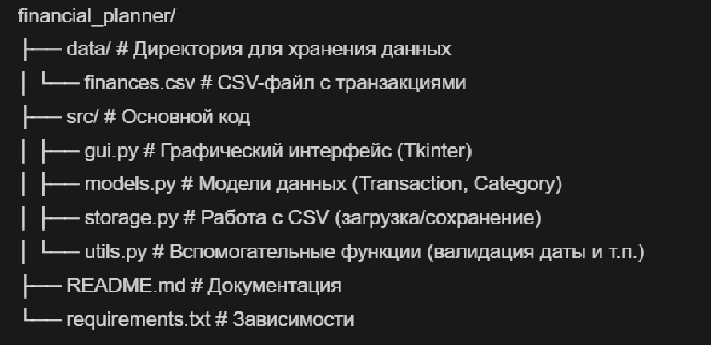

# Финансовый планировщик

Приложение для учёта личных финансов: ведение транзакций, анализ расходов/доходов, визуализация данных.

## Функционал

**Добавление транзакций**:
  - Сумма (руб.)
  - Категория (например, "Продукты", "Зарплата")
  - Тип (доход/расход)
  - Дата (формат ГГГГ-ММ-ДД)
  - Комментарий (опционально)

**Отображение данных**:
  - Таблица всех транзакций
  - Текущий баланс

**Анализ**:
  - Суммы доходов и расходов
  - Баланс

**Визуализация**:
  - График доходов/расходов по времени
  - Круговая диаграмма расходов по категориям
  - Топ-5 самых крупных расходов

## Структура проекта

