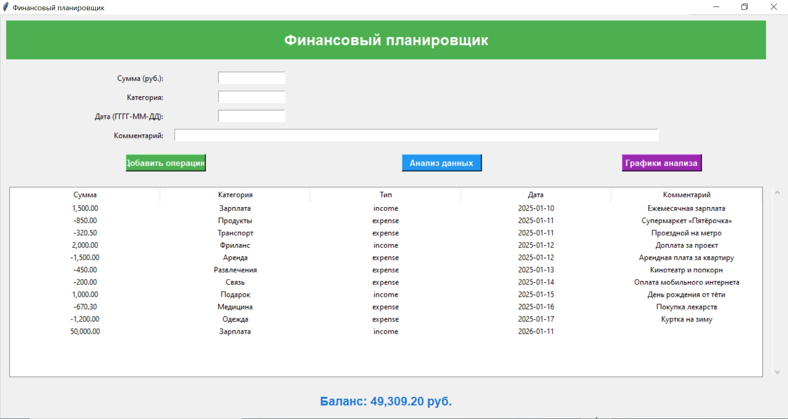
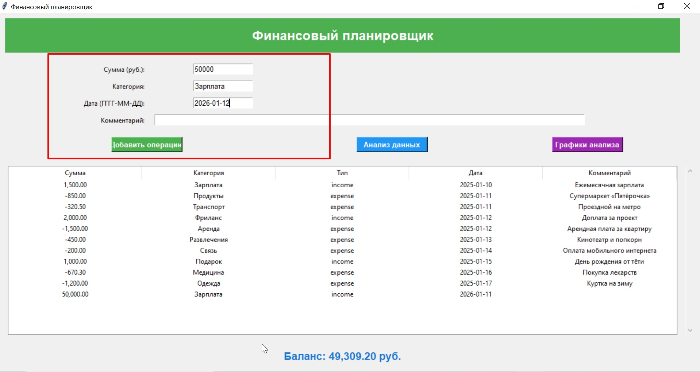
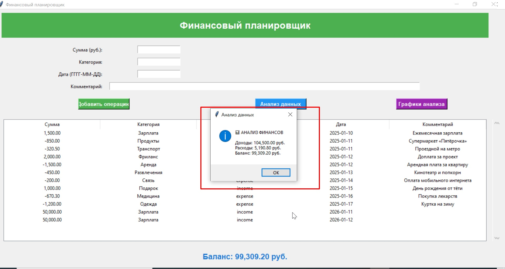
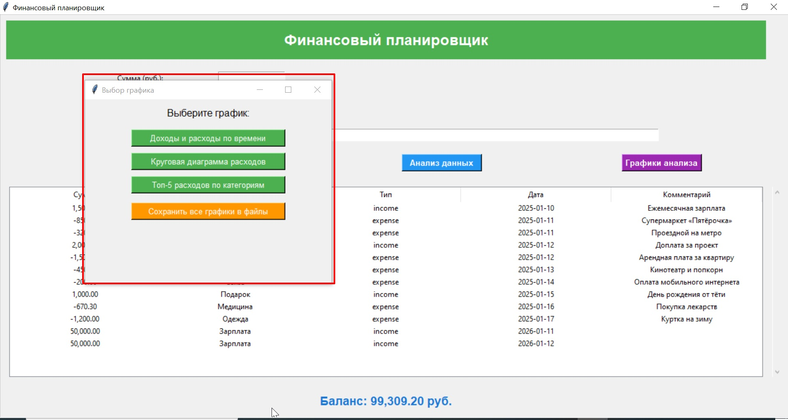
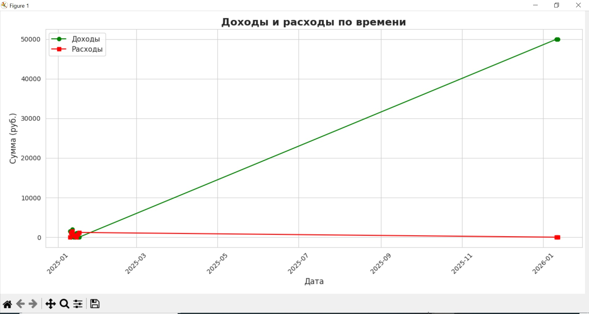
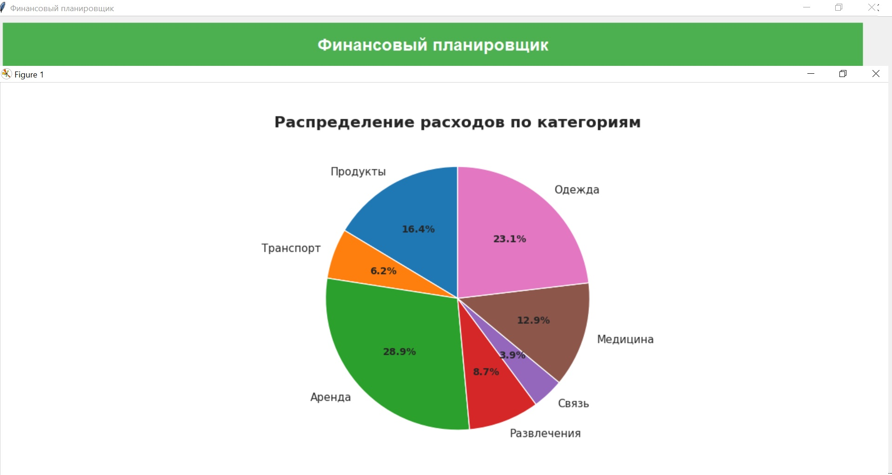
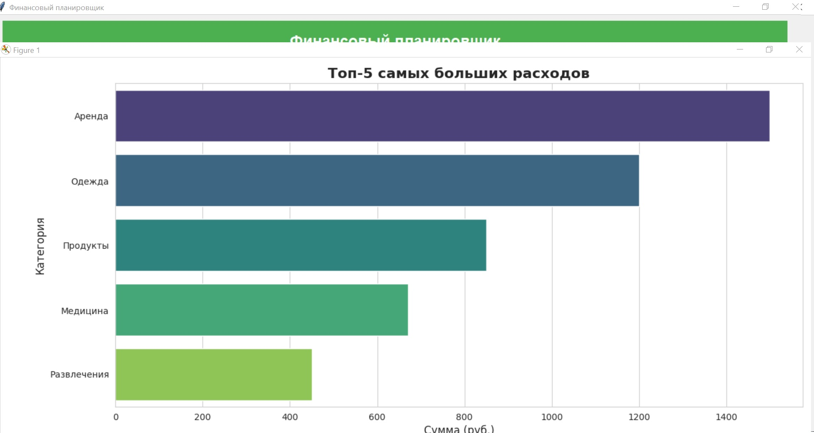

# Финансовый планировщик

Приложение для учёта личных финансов: ведение транзакций, анализ расходов/доходов, визуализация данных.

## Функционал

**Добавление транзакций**:
  - Сумма (руб.)
  - Категория (например, "Продукты", "Зарплата")
  - Тип (доход/расход)
  - Дата (формат ГГГГ-ММ-ДД)
  - Комментарий (опционально)

**Отображение данных**:
  - Таблица всех транзакций
  - Текущий баланс

**Анализ**:
  - Суммы доходов и расходов
  - Баланс

**Визуализация**:
  - График доходов/расходов по времени
  - Круговая диаграмма расходов по категориям
  - Топ-5 самых крупных расходов

## Структура проекта

## Описание модулей

### `src/gui.py`

**Назначение**: реализация графического интерфейса пользователя.

**Ключевые компоненты**:
- **Главное окно** (`FinanceApp`) — базовая оболочка приложения;
- **Таблица транзакций** (`ttk.Treeview`) — отображение списка операций;
- **Форма ввода новой транзакции** — интерфейс для добавления данных;
- **Панель анализа и визуализации** — элементы управления для просмотра статистики.

**Основные методы**:
- `create_widgets()` — инициализация всех элементов интерфейса;
- `add_transaction()` — обработка ввода и добавление новой транзакции;
- `refresh_transactions_list()` — обновление данных в таблице транзакций;
- `update_balance()` — пересчёт и отображение текущего баланса;
- `show_analysis()` — открытие окна с аналитикой и графиками.

---

### `src/models.py`

**Назначение**: определение структур данных для хранения информации о транзакциях и категориях.

**Классы**:

1. **`Category`**  
   **Поля**:  
   - `name` (`str`) — название категории (например, «Продукты», «Зарплата»);  
   - `category_type` (`str`) — тип категории (`income` для доходов, `expense` для расходов).

2. **`Transaction`**  
   **Поля**:  
   - `amount` (`float`) — сумма операции (положительная для доходов, отрицательная для расходов);  
   - `category` (`Category`) — ссылка на объект категории;  
   - `date` (`date`) — дата совершения операции;  
   - `comment` (`str`, опционально) — комментарий к транзакции.

---

### `src/storage.py`

**Назначение**: взаимодействие с CSV‑файлом для хранения данных.

**Функции**:
- `load_transactions()` — загрузка списка транзакций из `finances.csv`;
- `save_transactions(transactions)` — сохранение списка транзакций в файл.

**Особенности реализации**:
- автоматическая проверка наличия файла `finances.csv`;
- создание директории `data/` при первом запуске (если отсутствует);
- обработка ошибок:  
  - отсутствие файла;  
  - недостаточные права доступа;  
  - некорректный формат данных;
- валидация форматов:  
  - даты (`YYYY-MM-DD`);  
  - числовых значений (`amount`).

---

### `src/utils.py`

**Назначение**: вспомогательные функции для общих операций.

**Реализованные функции**:
- `is_valid_date(date_str)` — проверка строки на соответствие формату даты `YYYY-MM-DD`;
- `format_currency(amount)` — форматирование числового значения в денежный формат (например, `1 500,50 ₽`);
- `get_month_range()` — получение диапазона дат текущего месяца (для фильтрации транзакций).

---

## Скриншоты интерфейса

1. **Главное окно**  
     
   **Отображает**:  
   - таблицу транзакций с колонками: сумма, категория, тип, дата, комментарий;  
   - текущий баланс (итоговая сумма доходов и расходов);  
   - кнопки управления: «Добавить транзакцию», «Анализ», «Выход».

2. **Форма добавления транзакции**  
     
   **Поля ввода**:  
   - **Сумма** — числовое значение (например, `1500.50`);  
   - **Категория** — выбор из списка или ввод новой;  
   - **Тип** — переключатель между `Доход` и `Расход`;  
   - **Дата** — строка в формате `ГГГГ-ММ-ДД` (например, `2025-01-15`);  
   - **Комментарий** — текстовое поле для заметок (опционально).

3. **Окно анализа данных**  
     
   **Содержит**:  
     ***Доходы (сумма)***  
    ***Расходы (сумма)***  
     ***Баланс (сумма)***  

4.**График анализа**:  
   
   - **График доходов/расходов** — динамика по датам;
       
   - **Круговая диаграмма** — распределение расходов по категориям; 
      
   - **Топ‑5 крупнейших расходов** — список самых значительных трат.
     

